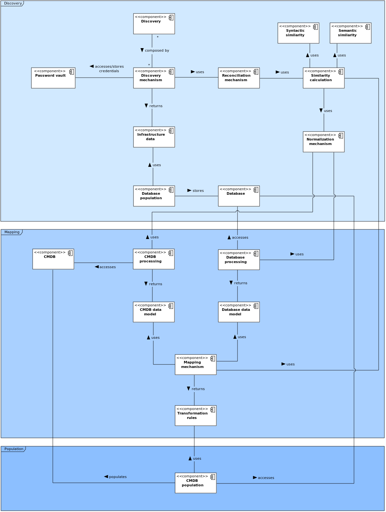
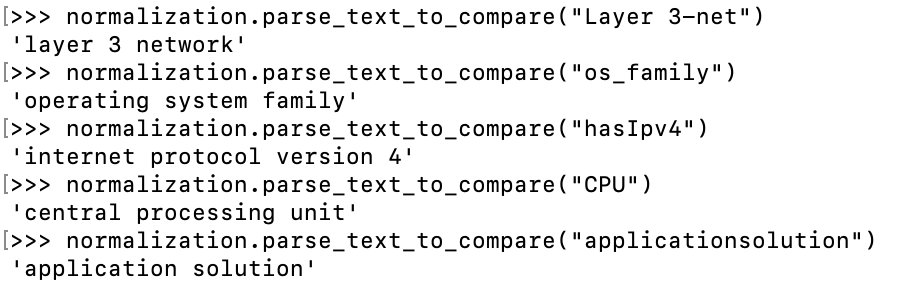

<?xml version="1.0"?>

<br/>
<p align="center"><h1 align="center">CMDB Automatic Creation</h1><p align="center">

Computing infrastructure management is becoming more demanding and must increasingly comply with regulatory requirements.
To meet these requirements, a Configuration Management Database (CMDB) is essential. One of the challenges that any team has when starting IT service management is to create the organization's CMDB.
CMDB is a database that stores information about the components, usually called CIs, of an infrastructure and the relationships between them. Thus, the CMDB creation implies discovering information about the infrastructure, saving this in the CMDB chosen by the organization.
The main goal of this project was the development of a method for automatic creation of a CMDB, using automatic discovery, mapping, and population mechanisms, to find information about the infrastructure components and store these results in the CMDB. Bearing in mind that different software products implement CMDBs, it's necessary to adapt the population according to the database structure.

## About the Project

This project provides an automatic mechanism to create a Configuration Management Database (CMDB).
This tool uses several discovery mechanisms to explore different types of components and the dependencies between them.
It also uses an automatic mapping mechanism to adapt the data model generated by the discovered data with the CMDB structure where they will be stored. It defines transformation rules between the data models, making correspondencies between the elements of the two models.
Finally, it populates the CMDB using its API to create the components and relationships.

The process of automatic creation of CMDB is divided into three phases: discovery, mapping and population. Each of this uses a set of smaller components to execute the necessary tasks.

## Folder Structure

* src: contains the source code of the tool
* external_data: stores data exported from external sources
* graphdb-import: stores the RDF file that contains the database structure and the discovered infrastructure information
* tests: contains the results of the executed tests

## Prerequisites

In order to take advantage of all the tool functionalities, it's necessary to answer the following requirements:

* CMDB Automatic Creation tool

```bash
# Clone this repository
git clone https://github.com/a78275/cmdb-auto-creation.git

# Change directory
cd cmdb-automatic-creation
```

* Support software

```bash
# Update and refresh repository lists
sudo apt update

# Install supporting software
sudo apt install build-essential software-properties-common libatlas-dev libatlas3-base libssl-dev libffi-dev libxml2-dev libxslt1-dev zlib1g-dev libperl-dev libsnmp-dev portaudio19-dev
```

* Python - version 3.9.1 recommended

```bash
# Install python and required libraries
sudo apt install python3.9 python3.9-dev python-setuptools python-scipy python-numpy
```

* Pip

```bash
# Install pip
sudo apt install python3-pip

# Upgrade pip
pip3 install --upgrade pip

# Install requirements
pip3 install -r requirements.txt
```

* Download required data

```bash
# Download spacy english pipeline
python3 -m spacy download en_core_web_lg

# Install NLTK data
python3 -m nltk.downloader stopwords
python3 -m nltk.downloader wordnet
```

* Nmap - for network mapping

```bash
# Install nmap
sudo apt install nmap
```

* Ping - to test the reachability of network hosts

```bash
# Install iputils-ping
sudo apt install iputils-ping
```

* Tshark - for data packet capturing

```bash
# Install tshark
sudo apt install tshark
```

* GraphDB - Install and create a repository to store the discovered data; it doesn't need to be installed on the same machine, but it needs access to the database

### Optional

* SNMP - Configuration is required to allow access by the machine; possible need to change credentials

```bash
# Install snmp and mibs
sudo apt install snmp snmpd snmp-mibs-downloader 

# Run SNMP
systemctl start snmpd.service
```

* LLDP - Configuration is required to allow receive (on the machine running the tool) and transmit mode (on the infrastructure machines); possible need to enable for the desired interfaces

```bash
#  Install LLDP
sudo apt install lldpad

# Run LLDP daemon
lldpad -d
```

## Running CMDB Automatic Creation

```bash
# Change to source code directory
cd src/

# Execute the tool - sudo permission is mandatory 
sudo ./cmdb_auto_creation.py
```

## How it works

The tool uses various components to execute the needed tasks.
The components can also be used independently.



### Database

Use of a generic data model for the database, to be able to create any necessary CI, relationship, or attribute.


As GraphDB allows the data import in RDF format, the model (classes, data properties, and object properties) and the discovered data are saved in a Turtle file, which can be imported to the database.

### Password vault

The machine credentials are necessary to obtain certain information.
Thus, there is a need to store them safely.

The password vault permits:

* the creation of a vault;
* the definition of the vault's password;
* unlock and lock the vault;
* store a new password, which is associated with a username and a domain;
* access to a stored password;
* delete the vault.


This was based on the project <a href="https://github.com/Jason-Azevedo/PasswordVault.git">PasswordVault</a>.

### Normalization mechanism

This mechanism imposes a global format to the information.
Performs data transformations, namely:

* removes text formats (snake, kebab, pascal and camel case);
* removes special characters (spaces, paragraphs, tabs,...);
* ignores case;
* expands acronyms;
* removes empty words (prepositions, conjunctions,...)
* removes punctuation.



### Reconciliation mechanism

The reconciliation mechanisms ensures that there isn't duplicate data and all information about an entity is combined in the same object.


### Discovery

Several mechanisms have been developed and are capable of discovering different types of information, namely:

* ICMP - ping to check reachability of network hosts;
* Nmap
    * name and type detection;
    * addresses identification;
    * ports exploration;
    * service detection;
    * operating system family detection.
* SNMP
    * routing tables;
    * ARP tables;
    * device type.
* LLDP - packet sniffing and neighbors information;
* SSH
    * OS X exploration:
        * operating system information;
        * processing;
        * storage systems;
        * geographic location;
        * installed software;
        * hardware specifications;
        * network conections and configurations.
    * Linux exploration:
        * operating system information;
        * processing;
        * storage systems;
        * installed software.
* WinRM - Windows exploration:
    * operating system information;
    * running services.
* External source - processing information exported from the Angry IP Scanner tool.

### Database population

All the discovered data is gathered and is generated in the RDF (Turtle) file that can be imported into GraphDB.

```
:host16 rdf:type :ConfigurationItemType ;
    :title "host".
	 
:layer_3_network101 rdf:type :ConfigurationItemType;
    :title "layer 3 network".
    
:part_of_network152 rdf:type :RelationshipType ;
	 :title "part of network". 
	 
:11516 rdf:type :ConfigurationItem ;
	 :status "up";
	 :os_family "linux";
	 :mac_address "52:54:00:f3:21:dc";
	 :has_ipv4 "192.168.121.164";
	 :has_attribute :221operating_system;
	 :has_ci_type :host16.

:221operating_system rdf:type :Attribute ;
	 :title "operating system";
	 :value "cumulus linux".
	 
:110101192_168_121_024 rdf:type :ConfigurationItem ;
	 :title "192.168.121.024";
	 :has_ci_type :layer_3_network101.
	
:169152part_of_network_192_168_121_024 rdf:type :Relationship ;
	 :title "part of network 192.168.121.024";
	 :has_source :11516;
	 :has_target :110101192_168_121_024;
	 :has_rel_type :part_of_network152.
```

### Database processing

This mechanism generates the representation of the database data model, capturing the terminology associated with each element.
The objective is to obtain the existing types of components and relationships and the attributes associated with them.
Considering that the engine used was GraphDB, it executes SPARQL queries to obtain all the necessary information.


### CMDB processing

This mechanism generates the representation of the CMDB data model, capturing the terminology associated with each element.
The objective is to obtain information about:

* the existing CI types;
* the existing relationship types;
* the attributes associated with each CI type;
* the attributes associated with each relationship type;
* the data type of each attribute;
* restrictions between the types of components involved in a relationship;
* possible values for predefined attributes.

This can be done through the CMDB API, in case this provides such requests, or directly accessing its database.
Has been developed mechanisms for the processing of i-doit and iTop CMDBs.

### Similarity calculation

The similarity coefficient calculation, which measures the similarity between two terms, it's based on the syntactic and semantic comparison between them.


### Mapping

The transformation rules that describe the mapping between the database and the CMDB data models are generated.
First, the similarity coefficients between all existing component and relationship types are calculated.
Then, all the values ​​are sorted in descending order and the most similar combinations are selected.
For the case in which are founded combinations with the same similarity value, the user is given the option to choose.
The same methodology is then applied to the attributes of each type of component or relationship.
In the end, the constructed mapping is presented, as well as the calculated similarity value.
The user must define a limit value for the final selection of the transformation rules. For all coefficients below the limit defined by the user, the rules are discarded.


### CMDB population

The objective is to send the collected information about the infrastructure to the CMDB. This settlement must be done through the CMDB API to avoid errors and inconsistencies in the data.
Has been developed mechanisms for the population of i-doit and iTop CMDBs.

This process is limited by what APIs can offer. Therefore, the amount of information that is stored in the CMDB is limited. 
